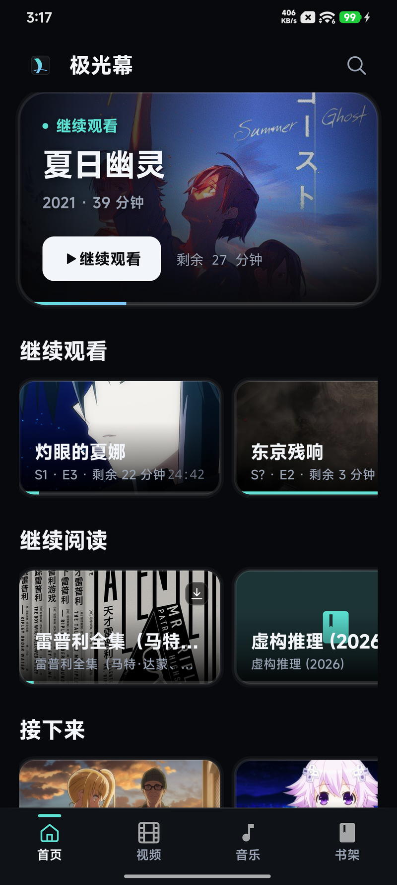
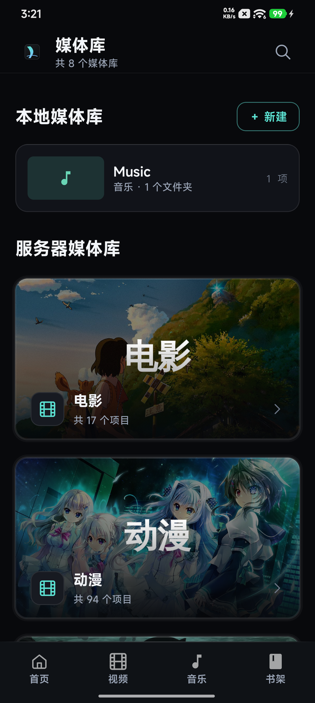
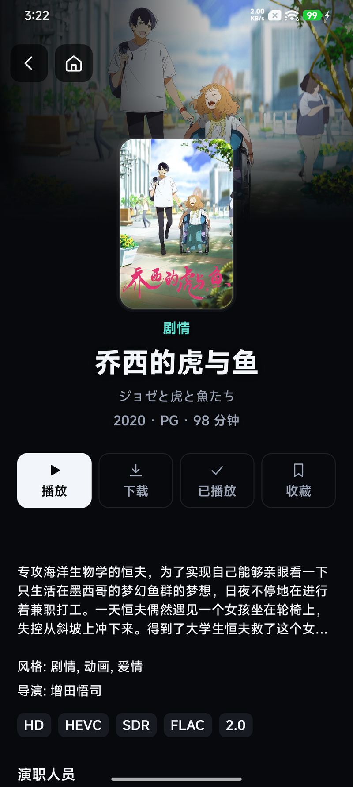
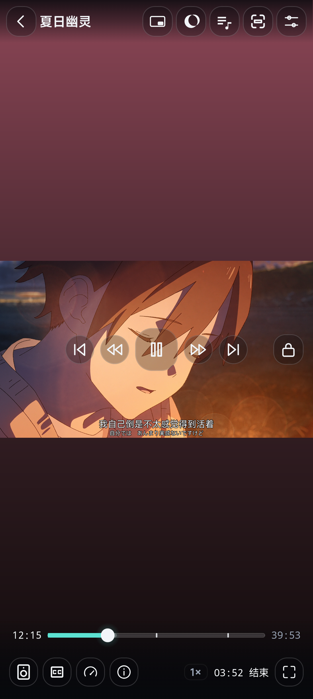
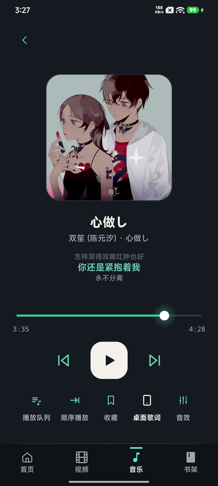
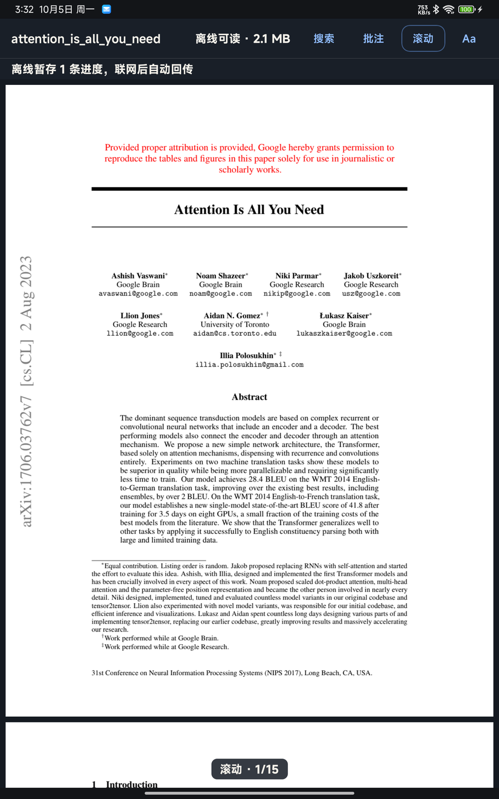
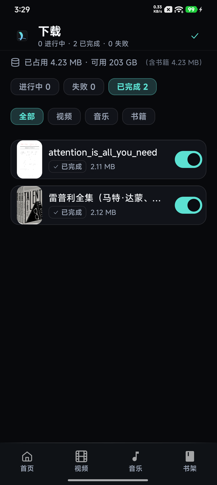
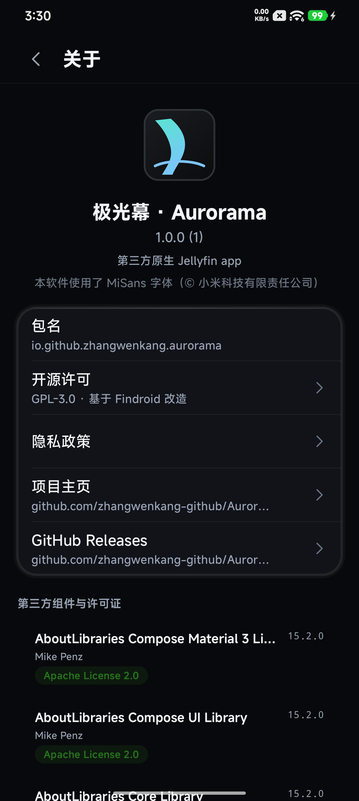
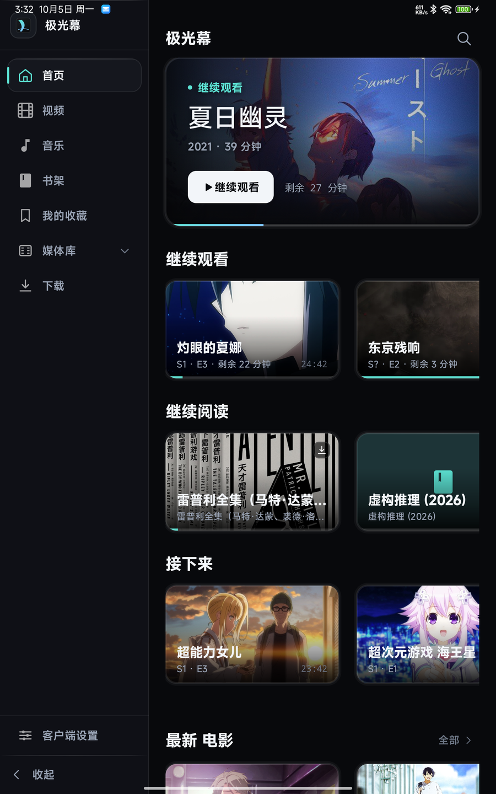

# 极光幕 · Aurorama

第三方原生 Jellyfin 客户端 · 平板优先 · 深色影院风

极光幕（Aurorama）是基于 [Findroid](https://github.com/jarnedemeulemeester/findroid)（GPL-3.0，基线 `a28ac9e`）改造的第三方 Jellyfin Android 客户端，面向手机与平板。
以直接播放（Direct Play）为主、不做转码；在常规浏览 / 播放之外，重点实现了播放器手势体系、字幕渲染与语言记忆、阅读器（EPUB / PDF / CBZ）、音乐（歌词 / 音效）与本地媒体库。

> 自用为主的开源项目；App 不收集、不上传任何数据（见 [PRIVACY](PRIVACY)）。

## 功能

**影视**

- 首页 / 媒体库 / 搜索 / 收藏 / 下载 / 服务器控制台；电影、剧集、季、单集全链路
- 播放内核：ExoPlayer（硬解）+ FFmpeg 软解，解码失败自动降级 libmpv（二级兜底）
- 字幕：SRT / VTT / SSA-ASS（libass 渲染，支持特效字幕）、外挂字幕导入、字幕语言优先级与跨视频记忆
- 手势：加载中也能用的双击 / 横滑快进快退（排队落点）、长按倍速、亮度 / 音量滑动、双指缩放
- 画中画、章节刻度与跳转、Trickplay 预览、片头片尾跳过
- 进度写回 Jellyfin；系统媒体面板可控（播放 / 暂停 / 上一集 / 下一集 / 关闭）

**音乐**

- 音乐库浏览、播放队列、后台与锁屏播放
- 歌词：内嵌 / 本地 LRC 导入与编辑、逐字歌词、悬浮歌词窗
- 音效：均衡器、ReplayGain、交叉淡化

**阅读（EPUB / PDF / CBZ）**

- EPUB（Readium）、PDF（PdfBox-Android，双栏整页 / 搜索 / 高亮批注）、CBZ 漫画自然序
- 阅读进度与 Jellyfin 同步

**下载 / 离线**

- 自研断点续传引擎（HTTP Range、暂停保片、失败分类与退避、存储预检）
- 整剧 / 整季 / 整专辑批量下载；剧集 → 季 → 集、专辑 → 曲目层级
- 离线媒体库与逐项「允许离线观看」

**本地媒体库**

- SAF 建库（视频 / 音乐 / 书籍），本地媒体扫描、缩略图与封面生成

**平板优先**

- 常显侧轨（可手动折叠、宽度自适应）、库内容双列网格、横竖屏与分屏适配

## 截图

> 实拍设备：手机 Redmi K60 / 平板 Xiaomi Pad 5（1.0.0 正式包，测试服务器）。

| 首页 | 媒体库（含本地媒体库） | 视频详情 |
|------|------------------------|----------|
|  |  |  |

| 播放器（字幕 / 章节刻度 / 结束时刻） | 音乐（全屏播放 + 歌词） | 阅读器（PDF） |
|--------------------------------------|--------------------------|----------------|
|  |  |  |

| 下载 / 离线 | 关于 | 平板形态 |
|-------------|------|----------|
|  |  |  |

## 下载

签名 APK 见 [GitHub Releases](https://github.com/zhangwenkang-github/Aurorama/releases)：

- `Aurorama-1.0.0-universal.apk` —— 全部 ABI（体积较大，兼容性最好）
- `Aurorama-1.0.0-arm64-v8a.apk` —— 主流 64 位手机 / 平板

要求：Android 9（API 28）及以上；Jellyfin 服务器（Trickplay 需 10.9+、媒体分段需 10.10+）。

## 构建

环境：JDK 21（`JAVA_HOME` 指向任意 JDK 21，如 Android Studio 自带 JBR）、Android SDK（compileSdk 37）。

```powershell
$env:JAVA_HOME='D:\Android\Android Studio\jbr'

# 调试包（applicationId 追加 .debug，可与正式包共存）
.\gradlew.bat :app:phone:assembleDebug --console=plain

# 发布包（release 签名需要仓库根 keystore.properties，见 docs/RELEASE_PLAN.md）
.\gradlew.bat :app:phone:assembleLibreRelease -Paurorama.universalApk=true --console=plain
```

产物在 `app/phone/build/outputs/apk/libre/release/`：默认产出 4 个 ABI 分包（armeabi-v7a / arm64-v8a / x86 / x86_64），加 `-Paurorama.universalApk=true` 追加 universal 整包。

发布流程（keystore、签名验证、GitHub Release 步骤）见 [docs/RELEASE_PLAN.md](docs/RELEASE_PLAN.md)。

## 隐私

极光幕是纯本地 Jellyfin 客户端：不收集、不上传任何数据；账号与服务器地址只存在本机。完整文本见 [PRIVACY](PRIVACY)。

## 许可证与致谢

本项目以 **GNU General Public License v3.0**（[LICENSE](LICENSE)）发布，基于 **Findroid** 改造：

- Findroid — <https://github.com/jarnedemeulemeester/findroid>（GPL-3.0，基线 `a28ac9e`）
- 功能与协议实现参考（未复制源码）：Jellyfin Android（GPL-2.0）、Next Player（GPL-3.0）

第三方组件与许可证清单见 [NOTICE](NOTICE)（App 内「设置 → 关于」可查看完整列表）。主要组件：

- **libass / ass-kt** —— SSA/ASS 特效字幕渲染
- **AndroidX Media3 / ExoPlayer** —— 播放内核与媒体会话
- **mpv / libmpv** —— 二级播放内核（解码失败兜底）
- **Readium Kotlin Toolkit** —— EPUB 渲染
- **PdfBox-Android** —— PDF 渲染 / 搜索
- **Jellyfin SDK for Kotlin** —— 服务器 API
- **Coil / OkHttp / Room / Hilt / Kotlinx** —— 图片、网络、数据库、依赖注入与序列化

字体：MiSans（© Xiaomi Technology Co., Ltd.）、Literata（SIL OFL）。

Jellyfin、Android 及相关商标归各自所有者。
