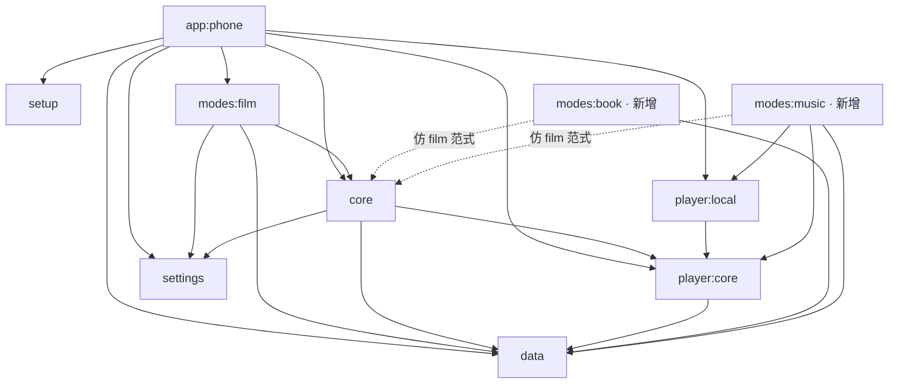
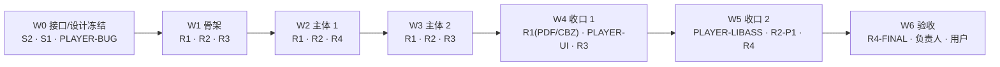

# Cinefin 并行开发计划（PARALLEL_PLAN）

| 项 | 值 |
|----|----|
| 版本 | v1.0（2026-09-29） |
| 需求基线 | `docs/REQUIREMENTS.md` v1.0 |
| 上游文档 | `docs/ROADMAP.md`（阶段划分与里程碑）、`docs/ROLE_SKILLS.md`（各角色必学 skill） |
| 会话模板 | `docs/SESSION_BRIEFS.md`（每个会话的启动指令模板） |
| **并发上限** | **4（含项目负责人）→ 每波最多 3 个开发会话 + 1 个负责人会话** |
| 分支约定 | 每会话 1 个 `feature/*` 分支 + 1 个独立 worktree；合并前 rebase 最新 `master`，PR 由负责人 + 架构师审查 |

---

## 1. 模块依赖分析

### 1.1 现有模块依赖图（依据 `settings.gradle.kts` 与调查记录）

- 新增 `modes/book`、`modes/music` 走 `modes:film` 的既有范式（依赖 core / data / settings）；
- 音乐线**复用** `player:core` 抽象与 `player:local` 的 ExoPlayer 管线，不引入新播放内核（C-tech-options §2.3）；
- `core → data` 是既有反向耦合（应避免扩大）；新模块不得再让 core 反向依赖新模块；
- 阅读器导航用 `AndroidView` 承载 Readium（Fragment/View 体系），Compose 只做外围壳层（R1 skill 清单 §5.1）。

### 1.2 可并行任务识别

| 任务 | 所属线 | 强依赖 | 可与谁并行 | 冲突点 |
|------|--------|--------|-----------|--------|
| Readium 集成 PoC + 阅读数据模型 | R1 | 阶段 0 接口冻结 | R2 / R3 / 播放器线 | `settings.gradle.kts`、`libs.versions.toml`、Room schema |
| 音乐模块骨架 + 单 MediaSession | R2 | `player:core` 会话模型冻结 | R1 / R3 | `settings.gradle.kts`、`player:core`、`AppPreferences` |
| 设计系统 Compose 落地 + 基础组件 | R3 | S1 设计系统冻结 | R1 / R2 / 播放器线 | `core` 主题、`NavigationRoot` |
| 歌词解析与双语识别（可离线单测） | R2 | Jellyfin 歌词 API（已实测） | R1 / R3 / R4 | `data` 层新增、无 UI 冲突 |
| 阅读进度同步与离线 | R1 | S2 进度接口 + 下载接口 | R2 歌词 / R3 页面 | `data` 层、下载仓库 |
| 播放器 §11 改造与 bug 修复 | 播放器线 | 无（bug 修复）；命中区契约（面板改造） | 各线（错峰改 `PlayerOverlayContainer`） | `PlayerControlOverlay.kt`、`PlayerOverlayContainer.kt` |
| 测试基建与回归 | R4 | 设备在线 + 测试数据 | 任何线（只读侧） | 无（不改业务代码） |

**结论**：接口冻结后，R1 / R2 / R3 / R4 四条线可以并行推进；冲突集中在 §1.3 的咽喉文件。

### 1.3 咽喉文件归属表（单波次单会话独占）

| 咽喉文件 / 区域 | 相关会话 | 归属策略 |
|----------------|---------|---------|
| `settings.gradle.kts`、`gradle/libs.versions.toml` | S2 / R1 / R2 / R3 | 阶段 0 由 S2 冻结新增模块与依赖清单；新增模块骨架由**负责人基线提交**后再开分支，避免并行会话各自改模块注册 |
| `NavigationRoot.kt`（路由） | R1 / R2 / R3 | 阶段 0 冻结路由契约；入口注册由 R3 统一提交，R1 / R2 只消费路由常量 |
| `AppPreferences.kt`（设置键） | R1 / R2 / R3 | 阶段 0 定义命名规范（`pref_reader_*` / `pref_music_*` / `pref_ui_*`）；各线只追加自己前缀的键，合并时冲突按 rebase 解决 |
| `player:core` / `player:local`（会话模型） | R2 / 播放器线 | 单 MediaSession 接口由 S2 冻结；R2 先实现（W1），播放器线在 W4 接入；同一波次禁止双方同时改 `player:core` |
| `PlayerControlOverlay.kt` / `PlayerOverlayContainer.kt` | 播放器线内部 | W0 只做 bug 修复（小改）；W4 面板右侧化 + 命中区一起改，避免与 W0 交叉 |
| `core` 主题 / `Typography.kt` | S1 / R3 | 设计 token 由 S1 定义（文档）；R3 单点落地 Compose 实现；Typography 归属在阶段 0 由 S2 决策归位 |
| Room schema / 数据库版本 | R1 / R2 | 阅读表与音乐缓存表分版本迁移；每个迁移由单个会话提交，另一线 rebase 后追加 |
| `.github/workflows/` | S2 / R4 | 阶段 0 由 S2 完成门禁；R4 只读使用，不改工作流 |

### 1.4 会话与分支命名

| 会话代号 | 分支名 | worktree |
|---------|--------|----------|
| S2-ARCH | `feature/s2-architecture` | 独立 worktree |
| S1-DS | `feature/s1-design-system` | 独立 worktree（可与 `feature/s1-ui-design` 复用后新开） |
| PLAYER-BUG | `feature/player-autoselect-fix` | 独立 worktree |
| R1-SKELETON | `feature/r1-reader-skeleton` | 独立 worktree |
| R2-SKELETON | `feature/r2-music-skeleton` | 独立 worktree |
| R3-TOKENS | `feature/r3-ui-tokens` | 独立 worktree |
| R1-CORE | `feature/r1-reader-core` | 独立 worktree |
| R2-CORE | `feature/r2-music-core` | 独立 worktree |
| R4-BASE | `feature/r4-test-base` | 独立 worktree |
| R1-OFFLINE | `feature/r1-reader-offline` | 独立 worktree |
| R2-LYRICS | `feature/r2-music-lyrics` | 独立 worktree |
| R3-PAGES-A | `feature/r3-ui-pages-a` | 独立 worktree |
| R1-PDFCBZ | `feature/r1-pdf-cbz` | 独立 worktree |
| PLAYER-UI | `feature/player-ui-refactor` | 独立 worktree |
| R3-PAGES-B | `feature/r3-ui-pages-b` | 独立 worktree |
| PLAYER-LIBASS | `feature/player-libass` | 独立 worktree |
| R2-P1 | `feature/r2-music-p1` | 独立 worktree |
| R4-REGRESSION | `feature/r4-regression` | 独立 worktree |
| R4-FINAL | `feature/r4-acceptance` | 独立 worktree |

---

## 2. 会话分配（波次制）

> 每波同时最多 3 个开发会话 + 项目负责人（并发 ≤4）。每个会话只做 1–2 个"一屏能验证完"的任务；
> 波内依赖见各波"依赖"列，波间依赖见 §3。

### W0 · 接口与设计冻结波（3 个开发会话）

| 会话 | 分支 | 输入 | 输出 | 验收 | 依赖 |
|------|------|------|------|------|------|
| S2-ARCH | `feature/s2-architecture` | REQUIREMENTS v1.0、findings、C-tech-options、现有模块代码 | `ARCHITECTURE.md`（模块图 + 接口冻结清单）、`DEV_STANDARDS.md`、`GIT_WORKFLOW.md` | 接口冻结清单评审通过；CI 在 PR 上生效 | 无 |
| S1-DS | `feature/s1-design-system` | s1-decision、三方向稿、REQUIREMENTS §6 | `UI_DESIGN_SYSTEM.md`（token / 按钮媒体色变形 / 页面蓝图）+ 全套页面稿 | token 可被 R3 直接消费；设计稿文件交付 | 无 |
| PLAYER-BUG | `feature/player-autoselect-fix` | `PLAYER_PLAN.md` §11 D 组（线索已定位） | 自动选字幕（默认轨兜底 + mpv `slang` 修复）、打开即播（`playWhenReady` 时序） | 任意带字幕新片打开自动出字幕；打开即播 | 无（小改，避开 §11 A–C/E） |

负责人：评审合并、预建 `modes/book` / `modes/music` 模块骨架与依赖注册（避免 W1 会话互抢 `settings.gradle.kts`）。

### W1 · 三线骨架波（3 个开发会话）

| 会话 | 分支 | 输入 | 输出 | 验收 | 依赖 |
|------|------|------|------|------|------|
| R1-SKELETON | `feature/r1-reader-skeleton` | ROLE_SKILLS §5.1、ARCHITECTURE 接口清单 | Readium 集成 PoC（打开 EPUB、翻页/滚动）、阅读数据模型、进度接口实现 | 真机打开真实 EPUB 并翻页；进度可读写 | W0 冻结 |
| R2-SKELETON | `feature/r2-music-skeleton` | ROLE_SKILLS §5.2、ARCHITECTURE、C-tech-options §2 | `modes/music` 骨架、单 MediaSession、列表→播放最小闭环 | 音乐列表可播；通知 / 锁屏可控 | W0 冻结；`player:core` 接口 |
| R3-TOKENS | `feature/r3-ui-tokens` | ROLE_SKILLS §5.3、`UI_DESIGN_SYSTEM.md` | Compose 主题（token）、基础组件（按钮媒体色变形 / 卡片 / 导航 / 抽屉） | 主题切换全 App 生效；组件预览通过 | W0 冻结 |

### W2 · 主体波 1（3 个开发会话）

| 会话 | 分支 | 输入 | 输出 | 验收 | 依赖 |
|------|------|------|------|------|------|
| R1-CORE | `feature/r1-reader-core` | W1 阅读器 PoC 结论、REQUIREMENTS EB-5/6/7 | 阅读模式（滚动 / 分页 / 双栏）、排版设置、主题（纸色 / 护眼 / 深色 / OLED） | 设置即时生效并持久化；平板双栏正确 | W1 R1 |
| R2-CORE | `feature/r2-music-core` | W1 音乐骨架、REQUIREMENTS MU-2/3/4/9 | 专辑 / 艺术家 / 歌曲 / 歌单浏览、队列、gapless、播放上报 | 连播无缝隙；队列操作正确；进度上报成功 | W1 R2 |
| R4-BASE | `feature/r4-test-base` | ROLE_SKILLS §5.4、REQUIREMENTS §9/§12、DEV_ENVIRONMENT | 真机矩阵、性能基线方法、测试数据清单、每波回归清单 | 基线数值可复现；测试数据清单提交用户确认 | 设备在线 |

### W3 · 主体波 2（3 个开发会话）

| 会话 | 分支 | 输入 | 输出 | 验收 | 依赖 |
|------|------|------|------|------|------|
| R1-OFFLINE | `feature/r1-reader-offline` | W2 阅读器主体、下载接口 | 进度同步（离线暂存 + 联网回传 + 冲突策略）、离线阅读（EB-9/EB-11）、书签 / 高亮基础（EB-8） | 离线可读；退出重进恢复进度；回传成功 | W2 R1 |
| R2-LYRICS | `feature/r2-music-lyrics` | 歌词实测结构（findings）、Jellyfin OpenAPI | 歌词双语配对、逐行语言识别、语言切换（默认简体中文）、滚动同步 + 单测 | 三样例（aLIEz / Brave Shine / 爱的回归线）识别正确 | W2 R2 |
| R3-PAGES-A | `feature/r3-ui-pages-a` | W2 页面结构、W1 token | 音乐 / 阅读页面接入新设计（浏览 / 正在播放 / 队列 / 书架 / 阅读页 / 设置） | 页面无旧配色；平板双栏体验通过 | W1 token；W2 结构 |

### W4 · 收口波 1（3 个开发会话）

| 会话 | 分支 | 输入 | 输出 | 验收 | 依赖 |
|------|------|------|------|------|------|
| R1-PDFCBZ | `feature/r1-pdf-cbz` | ROLE_SKILLS §5.1、REQUIREMENTS EB-3/EB-4 | PDF 分页懒加载（内存红线）、CBZ 基础阅读（单页 / 双页 / 缩放 / RTL） | PDF 内存峰值不随文档大小线性增长；CBZ 翻页正确 | W3 R1；测试内容到位 |
| PLAYER-UI | `feature/player-ui-refactor` | `PLAYER_PLAN.md` §11 A–E + §1.10 | 控件精简、图标 + 文字、面板右侧化、控件重排、视觉收口 | 面板打开不压缩画面；命中区无回归；真机走查通过 | W0 坐标；命中区契约 |
| R3-PAGES-B | `feature/r3-ui-pages-b` | UI-3 清单、W3 页面经验 | 首页 / 媒体库 / 详情 / 搜索 / 下载 / 设置 / 抽屉 / 欢迎页全套换新 | UI-3 全清单覆盖；旧配色清零 | W1 token；W3 页面 |

### W5 · 收口波 2（3 个开发会话）

| 会话 | 分支 | 输入 | 输出 | 验收 | 依赖 |
|------|------|------|------|------|------|
| PLAYER-LIBASS | `feature/player-libass` | `PLAYER_PLAN.md` §1.18、字幕管线现状 | libass 字幕渲染接入（保留语言识别与样式设置） | 特效 ASS 与电脑端基本一致；双内核切换不受影响 | W4 PLAYER-UI 合并 |
| R2-P1 | `feature/r2-music-p1` | REQUIREMENTS MU-7、P1 清单 | 睡眠定时、离线容量管理收尾、音乐 parity 批次 2 补缺 | 睡眠定时可用；离线管理可用 | W3 R2 |
| R4-REGRESSION | `feature/r4-regression` | 全部已合并功能、W2 基线 | 全量回归结果、性能红线对比报告 | 关键路径无回归；性能不劣化（超阈值有评审说明） | W2–W4 合并 |

### W6 · 验收波（1–2 个会话 + 用户）

| 会话 | 分支 | 输入 | 输出 | 验收 | 依赖 |
|------|------|------|------|------|------|
| R4-FINAL | `feature/r4-acceptance` | W5 回归结果、REQUIREMENTS §12 | 最终验收报告（功能 + 性能 + 真机矩阵） | §12.1 / §12.2 全过 | W5 合并 |
| 负责人 | `feature/release-prep`（文档 / 品牌资产） | 验收报告、GPL 合规清单 | GPL / NOTICE 检查、图标 / 启动图更新、README 更新 | 发布检查清单完成 | W5 合并 |

用户参与 W6 阶段验收（REQUIREMENTS §12.3）。

---

## 3. 时间线与交付节点

| 波次 | 预估时长 | 交付节点 | 对应里程碑（ROADMAP §4） |
|------|---------|---------|--------------------------|
| W0 接口与设计冻结 | 3–4 天 | ARCHITECTURE / DEV_STANDARDS / GIT_WORKFLOW / UI_DESIGN_SYSTEM + 播放器 bug 修复 | M-A |
| W1 三线骨架 | 4–5 天 | EPUB 可读 / 音乐可播 / 新主题生效 | M-B |
| W2 主体波 1 | 4–5 天 | 阅读器主体 + 音乐主体 + 测试基建 | — |
| W3 主体波 2 | 4–5 天 | 阅读离线与进度 + 歌词 + 音乐 / 阅读页面 | M-C |
| W4 收口波 1 | 4–5 天 | PDF / CBZ + 播放器 §11 + 全 UI 落地 | M-D |
| W5 收口波 2 | 4–5 天 | libass + 音乐 P1 + 全量回归 | M-E |
| W6 验收波 | 3–5 天 | 最终验收 + 发布准备 | M-F |
| **合计** | **26–34 个工作日（约 6–8 周日历，含协调与缓冲）** | | |

**依赖规则**：上一波未合并（或未明确豁免）前，下一波不得开工；每个 PR 合并前 rebase 最新 `master`，
由负责人 + 架构师审查；CI（Build + Format）全绿方可合并。

## 4. 并发纪律与冲突处理

1. **并发上限硬约束**：任何时刻 ≤4 个活跃会话（含负责人）；每波开工前由负责人点名，超出即排队。
2. **咽喉文件单写**：见 §1.3；同一波内出现两路要改同一文件时，先由 S2 拆接口，再允许并行。
3. **接口变更流程**：任何跨模块接口变更 → S2 接口冻结清单修订 → 通知受影响会话 → 双方 rebase 后继续；禁止先改代码后补文档。
4. **阻塞升级**：会话发现依赖未冻结 / 接口不清 → 停止改动，向负责人报告并等待 S2 结论，不做猜测性实现。
5. **会话交接**：每个会话收工前把进度 / 决策 / 踩坑写回对应任务线文档（或新线文档），保证下个会话无损接续。
6. **文档落点**：项目级状态写 `PROJECT_PLAN.md`；任务线细节写各自线文档；路线图变更写 `ROADMAP.md` 与本文档。

## 5. 版本历史

| 版本 | 日期 | 变更 |
|------|------|------|
| v1.0 | 2026-09-29 | 首版：模块依赖分析、咽喉文件表、W0–W6 波次分配、时间线与依赖图 |
