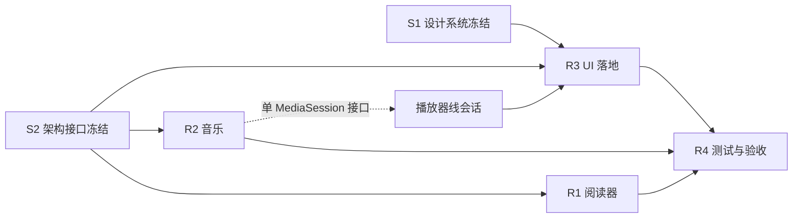

# Cinefin 路线图（ROADMAP）

| 项 | 值 |
|----|----|
| 版本 | v1.0（2026-09-29） |
| 需求基线 | `docs/REQUIREMENTS.md` v1.0（唯一权威；P0/P1/P2 定义见其 §8） |
| 输入 | `docs/design/s1-decision.md`、`.planning/cinefin-expansion/`（findings / B / C）、`docs/PLAYER_PLAN.md` |
| 配套文档 | `docs/PARALLEL_PLAN.md`（波次与并发细节）、`docs/SESSION_BRIEFS.md`（会话启动模板）、`docs/ROLE_SKILLS.md`（各角色必学 skill） |
| 核心原则 | **接口先行 → 并行开发**；并发上限 4（含项目负责人，即每波 ≤3 个开发会话）；单会话只做 1–2 个"一屏能验证完"的任务 |

---

## 1. 总原则

1. **接口先行**：先冻结接口与设计 token（阶段 0），再放开并行开发。任何跨模块接口变更必须先走 S2 的接口冻结清单，禁止边开发边改契约。
2. **并行边界 = 模块边界**：按 `modes/book`、`modes/music`、UI 组件层、测试线切分；共享"咽喉文件"（见 `PARALLEL_PLAN.md` §2）由单会话单波次独占。
3. **P0 优先、P1 顺带、P2 不做**：阶段 1–3 覆盖 P0，阶段 4 消化 P1，P2 明确后置不进路线图。
4. **每阶段可验收**：每个阶段有明确交付节点；用户在阶段里程碑验收（REQUIREMENTS §12.3）。
5. **保护性优先**：视频播放器现有能力（M4/M6 已完成部分）不得回归；播放器线与扩展线并行时以接口隔离，见 `PLAYER_PLAN.md`。

## 2. 优先级映射（对齐 REQUIREMENTS §8）

| 优先级 | 内容 | 对应阶段 |
|--------|------|---------|
| **P0（本期必做）** | EPUB 阅读器（进度同步 + 离线）、音乐模式（浏览 / 播放 / 队列 / 歌词 / 离线 / 通知）、UI 设计体系与关键页面落地、工程门禁（PR / CI / 单测 / 规范） | 阶段 0–3 |
| **P1（本期尽量）** | PDF 分页懒加载、CBZ 基础阅读、睡眠定时、parity 批次 2 其余项、libass 字幕、稳定性收尾 | 阶段 4 |
| **P2（后续）** | PDF 搜索 / 批注、逐字歌词、EQ / crossfade / ReplayGain、Android Auto、Chromecast、本地文件导入、词典 / 翻译 / TTS、多队列 | 不进本路线图（§6 附录） |

---

## 3. 阶段划分

### 阶段 0 · 接口与规范冻结（P0 前置）

| 项 | 内容 |
|----|------|
| **目标** | 冻结跨模块接口、设计 token 与工程门禁，使阶段 1 起可真正并行 |
| **交付物** | S2：`ARCHITECTURE.md`（模块依赖图 + 接口冻结清单）、`DEV_STANDARDS.md`（ktfmt / 单测 / 审查）、`GIT_WORKFLOW.md`（分支 / PR / CI）；S1：`UI_DESIGN_SYSTEM.md`（token、按钮媒体色变形、全套页面稿）；负责人：CI 在 PR 上跑通（Build + Format） |
| **依赖关系** | 无（REQUIREMENTS v1.0 已确认）；本阶段是阶段 1–4 的强制前置 |
| **预估工作量** | 5–7 会话日（2 路并行：S2 ≈3 天 + S1 ≈3 天，含评审） |
| **涉及角色** | S2、S1、项目负责人 |
| **验收要点** | 接口冻结清单评审通过；设计 token 可被 R3 直接消费；CI 对 PR 生效 |

**接口冻结清单（最小集，S2 必须覆盖）**：

- 阅读：`UserItems/{itemId}/UserData` 读写封装（EB-9）、阅读数据模型（进度 / 书签 / 高亮）、离线下载接口（EB-11）；
- 音乐：单 MediaSession 会话模型与音视频互斥（MU-8）、队列模型（MU-3）、歌词数据模型（MU-5）、播放上报（MU-9）；
- 导航：`NavigationRoot` 路由契约（阅读器入口替换 Web 控制台分支，EB-10；音乐模式入口，MU-1）；
- 设置：`AppPreferences` 新增键的命名与迁移约定（阅读 / 音乐 / UI 三线共用）；
- 下载：现有 Downloader / Room 离线仓库的复用边界（阅读与音乐共用）。

### 阶段 1 · 三线骨架（P0）

| 项 | 内容 |
|----|------|
| **目标** | 阅读器、音乐、设计系统三条线各自跑通最小闭环，验证接口可用 |
| **交付物** | R1：Readium 集成 PoC（打开 EPUB、翻页/滚动）+ 阅读数据模型 + 进度接口实现；R2：`modes/music` 模块骨架 + 单 MediaSession + 列表→播放最小闭环；R3：设计 token → Compose 主题 + 基础组件（按钮媒体色变形 / 卡片 / 导航 / 抽屉） |
| **依赖关系** | 阶段 0 冻结；R1 依赖 Readium 选型结论（C 调研已完成）；R2 依赖 `player:core` 接口冻结；R3 依赖 S1 设计系统 |
| **预估工作量** | 7–9 会话日（3 路并行，各 2–3 天） |
| **涉及角色** | R1、R2、R3、项目负责人 |
| **验收要点** | 打开真实 EPUB 并翻页；音乐列表可播且通知 / 锁屏可控；主题切换全 App 生效且无旧配色残留 |

### 阶段 2 · 阅读与音乐主体（P0）

| 项 | 内容 |
|----|------|
| **目标** | 完成 P0 两条新线的完整功能面 |
| **交付物** | R1：EB-5/6/7/9/11（阅读模式、排版、主题、进度回写、离线）；R2：MU-2/3/4/5/6/7/9（曲库浏览、队列、gapless、歌词双语、离线、系统集成、上报）；R4：测试基建（真机矩阵、性能基线、测试数据清单）；R3：音乐 / 阅读页面接入新设计（皮肤层） |
| **依赖关系** | 阶段 1 骨架与接口验证通过；R4 的测试数据依赖用户补充 PDF / CBZ 与歌词样例 |
| **预估工作量** | 12–16 会话日（2 个波次 × 3 路并行，每路 4–5 天） |
| **涉及角色** | R1、R2、R4、R3（次波）、项目负责人 |
| **验收要点** | REQUIREMENTS §12.2 电子书 / 音乐条目通过；歌词三样例（aLIEz / Brave Shine / 爱的回归线）识别正确、默认简体中文；离线可用 |

### 阶段 3 · UI 全面落地与播放器改造（P0 贯穿 + P1 启动）

| 项 | 内容 |
|----|------|
| **目标** | UI-3 全页面覆盖新设计；播放页控制层重构（`PLAYER_PLAN.md` §11）与视觉收口 |
| **交付物** | R3：首页 / 媒体库 / 详情 / 搜索 / 下载 / 设置 / 抽屉 / 欢迎页全套换新；播放器线：§11 A–E（控件精简 / 图标文案 / 面板右侧化 / 自动选字幕与自动播放 bug / 版式重排）+ §1.10 视觉收口；旧"墨+朱砂"配色清零 |
| **依赖关系** | 阶段 0 设计系统；阶段 2 阅读 / 音乐页面结构稳定；播放器改造依赖 `PlayerOverlayContainer` 命中区走查（`PLAYER_PLAN.md` §5.2/§9） |
| **预估工作量** | 10–14 会话日（2 个波次 × 2–3 路并行） |
| **涉及角色** | R3、播放器线会话、R1/R2（页面配合）、项目负责人 |
| **验收要点** | UI-3 清单全部覆盖；手机 / 平板无布局回归；动效流畅；两个 bug 修复（打开即播、自动出字幕）真机确认 |

### 阶段 4 · P1 补齐与 parity（P1）

| 项 | 内容 |
|----|------|
| **目标** | 消化 P1：PDF / CBZ、libass、睡眠定时、parity 批次 2 其余、稳定性 |
| **交付物** | R1：EB-3（PDF 分页懒加载 + 内存红线）、EB-4（CBZ + RTL）；播放器线：§1.18 libass 字幕渲染 + §1.5/§1.6–1.9 穿插项；R2：MU-7 睡眠定时 + 离线容量管理收尾；R4：全量回归 + 性能对比报告；parity 差距表补齐 |
| **依赖关系** | 阶段 2/3 功能稳定；PDF / CBZ 测试内容到位；libass 接入方案调研（`PLAYER_PLAN.md` §1.18） |
| **预估工作量** | 8–12 会话日（2 个波次 × 3 路并行） |
| **涉及角色** | R1、R2、播放器线会话、R4、项目负责人 |
| **验收要点** | PDF 内存峰值不随文档大小线性增长；CBZ 翻页与 RTL 正确；libass 特效应字幕与电脑端基本一致 |

### 阶段 5 · 验收与发布准备（P0/P1 收口）

| 项 | 内容 |
|----|------|
| **目标** | 全量回归、用户阶段验收、发布准备（GPL 合规 / 图标 / 文档） |
| **交付物** | R4：真机回归矩阵结果、性能红线对比（启动 / 内存 / 体积）；负责人：GPL 合规检查（NOTICE / 许可清单）、品牌资产更新（图标 / 启动图）、README 更新、用户验收记录 |
| **依赖关系** | 阶段 3/4 全部合并；无未闭环的 P0 缺陷 |
| **预估工作量** | 4–6 会话日 |
| **涉及角色** | R4、项目负责人、用户（阶段验收） |
| **验收要点** | REQUIREMENTS §12.1 通用门禁全过；§12.2 功能验收全过；性能不劣化（超阈值需评审说明） |

---

## 4. 里程碑与交付节点

| 节点 | 对应阶段 | 判定标准 |
|------|---------|---------|
| **M-A 接口与设计冻结** | 阶段 0 末尾 | ARCHITECTURE / DEV_STANDARDS / GIT_WORKFLOW / UI_DESIGN_SYSTEM 四份文档齐备并评审通过；CI 对 PR 生效 |
| **M-B 骨架跑通** | 阶段 1 末尾 | EPUB 可读、音乐可播、新主题生效（三个 demo 真机演示） |
| **M-C P0 功能完成** | 阶段 2 末尾 | 阅读器与音乐按 REQUIREMENTS §12.2 通过验收；测试基建就绪 |
| **M-D 全 UI 落地** | 阶段 3 末尾 | UI-3 全页面覆盖；播放器 §11 完成；无可视旧配色 |
| **M-E P1 收口** | 阶段 4 末尾 | PDF / CBZ / libass / 睡眠定时完成；性能红线通过 |
| **M-F 验收发布** | 阶段 5 末尾 | 用户阶段验收通过；发布检查清单完成 |

时间线（波次口径，细节见 `PARALLEL_PLAN.md`）：W0 = 阶段 0；W1 = 阶段 1；W2–W3 = 阶段 2（W3 含阶段 3 启动）；
W4 = 阶段 3 收口 + 阶段 4 启动；W5 = 阶段 4 收口；W6 = 阶段 5。总预估 **6–8 周**（按 3 路并行 + 负责人协调）。

## 5. 依赖关系总览

- **强依赖（阻塞）**：阶段 0 → 阶段 1 → 阶段 2 → 阶段 3/4 → 阶段 5；
- **弱依赖（协调）**：R2 与播放器线共享 `player:core` / `player:local`（需错峰或接口先行）；R3 的播放器改造依赖播放器线提供的命中区契约；
- **外部依赖**：用户补充测试内容（PDF / CBZ / 歌词样例 / K60 型号）；服务器保持只读 + 用户数据写白名单。

## 6. 风险与应对

| 风险 | 影响 | 应对 |
|------|------|------|
| `PLAYER_PLAN.md` D2「本轮只做视频播放，音乐不做」与 REQUIREMENTS v1.0 音乐需求冲突 | 播放器线决策文档与项目基线不一致 | 以 REQUIREMENTS v1.0 为准；播放器线会话首轮更新 D2（本文件不代改） |
| S2 架构文档尚未产出 | 阶段 1 并行开发无接口契约，返工风险高 | 阶段 0 强制前置；未冻结不开工（本路线图硬约束） |
| 测试内容不足（PDF / CBZ / 歌词样例 / K60 型号） | P1 验收被阻塞 | 阶段 0 内向用户收集；R4 在阶段 2 前完成测试数据清单 |
| 咽喉文件冲突（settings.gradle.kts / NavigationRoot / AppPreferences / player:core） | 并行会话互相覆盖 | 见 `PARALLEL_PLAN.md` §2 咽喉文件归属表；单波次单会话独占 |
| 服务器只读约束 | 写操作被误触发 | REQUIREMENTS §11 白名单；R4 在回归清单中固化检查项 |
| 上下文预算 | 长会话中断 | 每会话开工读任务线文档、收工写回；单会话 1–2 个可验证任务 |

## 7. 附录 · P2 后置清单（不进本期路线图）

PDF 搜索 / 批注、逐字歌词（karaoke）、EQ / crossfade / ReplayGain、Android Auto、Chromecast、桌面小组件、
本地文件导入、OPDS、词典 / 划词翻译 / TTS、多队列、有声书 read-along（服务端不支持）、MOBI / AZW3 原生渲染、
TV 端增强（冻结，仅保证可编译）。以上条目如需重新纳入，按 REQUIREMENTS §13 变更管理流程评估。

---

## 8. 版本历史

| 版本 | 日期 | 变更 |
|------|------|------|
| v1.0 | 2026-09-29 | 首版：阶段 0–5、P0/P1/P2 映射、里程碑、依赖图与风险 |
